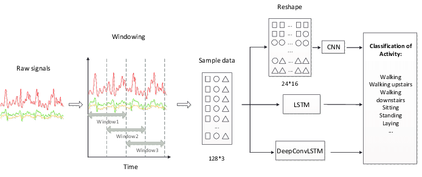

# CMPE_HAR

<div id="top"></div>

<!-- TABLE OF CONTENTS -->
<details>
  <summary>Table of Contents</summary>
  <ol>
    <li>
      <a href="#about-the-project">About The Project</a></li>
    <li>
      <a href="#getting-started">Getting Started</a></li>
    <li>
      <a href="#usage">Usage</a></li>
    <li>
      <a href="#architecture">Architecture</a></li>
  </ol>
</details>


<!-- ABOUT THE PROJECT -->
## About The Project
* Construction Management and Project Engineering
* Human Activity Recognition by IMU Sensors
<p align="right">(<a href="#top">back to top</a>)</p>

<!-- GETTING STARTED -->
## Getting Started

### Installation

1. Clone the repo
   ```sh
   git clone https://github.com/separk-1/CMPE_HAR.git
   ```
2. Install packages
   ```sh
   pip install -r requirements.txt  
   ```

<p align="right">(<a href="#top">back to top</a>)</p>

<!-- USAGE EXAMPLES -->
## Usage
### 0. Dataset

### 1. DataPreprocessing
#### 1) Set config
* Set parameter for running
* path: /config/config.yaml
#### 2) DataPreprocessing
```sh
example
```

### 2. Train & Predict
#### 1) Train
#### 2) Predict


### 3. Result Analysis
<p align="right">(<a href="#top">back to top</a>)</p>


<!-- Architecture -->
## Architecture


<p align="right">(<a href="#top">back to top</a>)</p>
